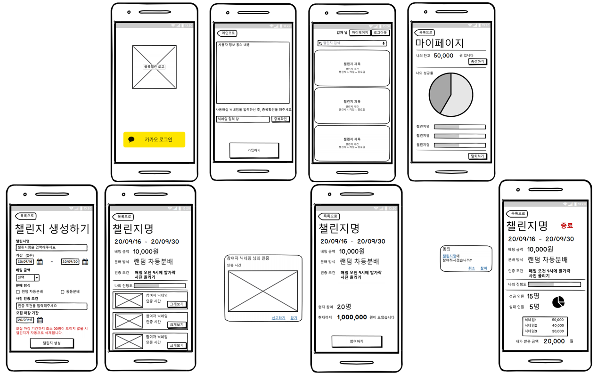
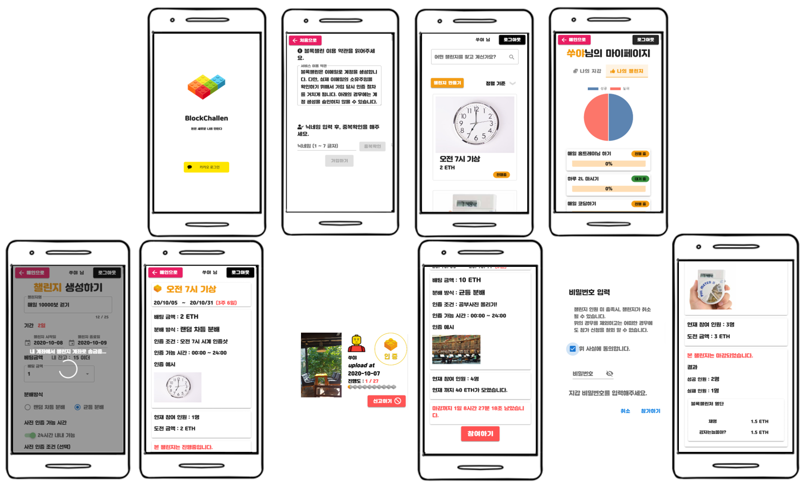

# 블록챌린 - BlockChallen


##### 블록체인을 기반으로 원하는 목표를 설정하고, 목표 달성 시 암호화폐로 보상받는 서비스


[BlockChallen 보러가기](https://j3a102.p.ssafy.io)


-------


##### 계정

- 회원
  - 카카오 소셜 로그인 / 로그아웃
- 지갑
  - 계좌 생성
  - 카카오 페이로 이더 충전

##### 챌린지

- 생성

  - 챌린지 계좌 생성
  - 배팅 금액(이더) 송금

- 참가

  - 배팅 금액(이더) 송금
  - 사진 인증
    - 최근 수정일 == 인증일 ? 인증 성공 : 실패
    - 블록체인에 사진 해싱 데이터 저장
    - 해싱 데이터 기반 위변조 검사
    - 회원 간 신고

- 결과

  - 85% 이상 참가 시, 성공
  - 분배 조건(랜덤 / 균등)에 따른 배팅 금액 자동 분배

- 삭제

  - 최소 참가 인원 미달 시, 자동 삭제

  - 삭제 시, 배팅 금액 자동 환급

    

------


##### :woman: 최현수 (프론트 / 팀장)

##### :man: 박형민 (프론트)

##### :woman: 이채영 (프론트)

##### :woman: 이유진 (백)

##### :man: 임진섭 (백)


-------


### :black_nib: 와이어프레임




### :black_nib: 구현 결과




-------


### :hammer_and_wrench: 사용 기술

 

    

     


----


### :deciduous_tree: 파일 구조

```Frontend
frontend
 ├── .gitignore
 ├── babel.config.js
 ├── frontend.iml
 ├── package-lock.json
 ├── package.json
 ├─> public
 │   ├─> block
 │   │   ├── block0.jpg
 │   │   ├── block1.jpg
 │   │   ├── block10.jpg
 │   │   ├── block2.jpg
 │   │   ├── block3.jpg
 │   │   ├── block4.jpg
 │   │   ├── block5.jpg
 │   │   ├── block6.jpg
 │   │   ├── block7.jpg
 │   │   ├── block8.jpg
 │   │   └── block9.jpg
 │   ├── certification.jpg
 │   ├── index.html
 │   ├── kakaopay.png
 │   ├── lego.ico
 │   ├── lego.png
 │   └── uncertification.jpg
 ├─> src
 │   ├── App.vue
 │   ├─> assets
 │   │   ├── kakao_login_large_narrow.png
 │   │   └── logo.svg
 │   ├─> components
 │   │   ├── BlockProgress.vue
 │   │   ├── CertificationReport.vue
 │   │   ├── ChallengeModal.vue
 │   │   ├── Footer.vue
 │   │   ├── KakaoPay.vue
 │   │   ├── KakaoPayCancel.vue
 │   │   ├── KakaoPaySuccess.vue
 │   │   ├── Loading.vue
 │   │   ├── MyWalletCharging.vue
 │   │   ├── PasswordModal.vue
 │   │   └── PictureModal.vue
 │   ├── EventBus.js
 │   ├── main.js
 │   ├─> plugins
 │   │   └── vuetify.js
 │   ├─> router
 │   │   └── index.js
 │   ├─> store
 │   │   └── index.js
 │   └─> views
 │       ├── ChallengeCreate.vue
 │       ├── ChallengeDetail.vue
 │       ├── ChallengeList.vue
 │       ├── Home.vue
 │       ├── MyPage.vue
 │       ├── PageNotFound.vue
 │       ├── SignUp.vue
 │       └── SocialLogin.vue
 ├── vue.config.js
 └── yarn.lock
```

```backend
backend
 ├── .gitignore
 ├── blockchallen.iml
 ├── mvnw
 ├── mvnw.cmd
 ├── package-lock.json
 ├── pom.xml
 └─> src
     └─> main
         ├─> java
         │   └─> com
         │       └─> ssafy
         │           └─> blockchallen
         │               ├── BlockchallenApplication.java
         │               ├── CertificationRunner.java
         │               ├─> config
         │               │   ├── ScheduleConfig.java
         │               │   └── SwaggerConfig.java
         │               ├─> controller
         │               │   ├── AccountController.java
         │               │   ├── CertificationController.java
         │               │   ├── ChallengeController.java
         │               │   ├─> exception
         │               │   │   ├── ControllerExceptionHandler.java
         │               │   │   ├── ErrorMessage.java
         │               │   │   └── ResourceNotFoundException.java
         │               │   ├── KakaoPayController.java
         │               │   └── WalletController.java
         │               ├─> dto
         │               │   ├── AmountVO.java
         │               │   ├── CardVO.java
         │               │   ├── certificationDTO.java
         │               │   ├── certificationForCLDTO.java
         │               │   ├── certificationListDTO.java
         │               │   ├── checkPictureDTO.java
         │               │   ├── createChallengeDTO.java
         │               │   ├── detailChallengeDTO.java
         │               │   ├── failDTO.java
         │               │   ├── findAccountDTO.java
         │               │   ├── findWalletDTO.java
         │               │   ├── idDTO.java
         │               │   ├── KakaoPayApprovalVO.java
         │               │   ├── KakaoPayReadyVO.java
         │               │   ├── myChallengeDTO.java
         │               │   ├── reportDTO.java
         │               │   ├── resultChallengeDTO.java
         │               │   ├── setNicknameDTO.java
         │               │   ├── successDTO.java
         │               │   └── walletDTO.java
         │               ├─> entity
         │               │   ├── Account.java
         │               │   ├── Certification.java
         │               │   ├── Challenge.java
         │               │   ├── Reward.java
         │               │   └── Wallet.java
         │               ├─> repository
         │               │   ├── AccountRepository.java
         │               │   ├── CertificationRepository.java
         │               │   ├── ChallengeRepository.java
         │               │   ├── RewardRepository.java
         │               │   └── WalletRepository.java
         │               ├─> service
         │               │   ├── IAccountService.java
         │               │   ├── ICertificationService.java
         │               │   ├── IChallengeService.java
         │               │   ├─> impl
         │               │   │   ├── AccountService.java
         │               │   │   ├── CertificationService.java
         │               │   │   ├── ChallengeService.java
         │               │   │   └── WalletService.java
         │               │   └── IWalletService.java
         │               └── WalletRunner.java
         └─> resources
             └── application.properties
```


-------


### :page_facing_up: Commit 규칙

##### [BE/FE/FS] initial/update | 내용 | Jira 이슈 번호

> BE : 백
>
> FE : 프론트
>
> FS : 풀스택


##### README(이름)


### :page_facing_up: Branch 규칙

##### feature/기능명 으로 develop에서 분기해서 사용하고, 기능 개발 완료 후 develop에 머지!


----


### :computer: AWS 서버

#### Geth

```aws
// AWS 접속
$ ssh -i [pem 저장 경로]/[pem 키] ubuntu@j3a102.p.ssafy.io

// Docker 접속
$ sudo docker exec -it eth /bin/bash

// geth 백그라운드 실행
$ nohup geth --networkid 1225 --maxpeers 2 --datadir /node1/ --rpc --rpcapi "admin,db,eth,debug,miner,net,shh,txpool,personal,web3" --rpccorsdomain "*" --rpcaddr='0.0.0.0' --rpcvhosts="*" --rpcport "8545" >> /node1/geth.log &

// geth 접속
$ geth attach rpc:http://localhost:8545
$ geth attach rpc:http://j3a102.p.ssafy.io:8545
```

#### CI/CD

---

##### Jenkins

> Gitlab에서 push와 같은 webhook을 날리면 Jenkins에서 repository를 가지고 와서 프론트엔드와 백엔드를 빌드

[Jenkins sever](http://j3a102.p.ssafy.io:8070/)

>  id : ```visitor``` password : ``` j3a102```

빌드 완료 시 SSH & SCP를 통해 AWS로 빌드된 파일을 날리고 sh파일과 Dockerfile을 통해 자동 배포

```shell
## front.sh
sudo rm -rf /var/www/html/dist
sudo mv {front.sh 파일 경로} /var/www/html/dist
sudo service nginx restart
```

```shell
## back.sh
sudo docker stop be
sudo docker rm be
sudo docker rmi be
sudo docker built -t be /{도커 파일 경로}
sudo docker run --name be -d -v /etc/localtime:/etc/localtime:ro -v /usr/share/zoneinfo/Asia/Seoul:/etc/timezone:ro -p 8080:8080 be
```

```dockerfile
## Dockerfile
FROM openjdk:8-jre
COPY /{*.jar 파일 경로}/*.jar app.jar
CMD ["java","-jar","/app.jar"]
```


#### 직접 빌드 시,

```build
// 백엔드 target 폴더 올리기
$ scp -i [pem키 경로] -r [target 폴더 경로] ubuntu@j3a102.p.ssafy.io:~/target

// 프론트엔드 target 폴더 올리기
$ scp -i [pem키 경로] -r [dist 폴더 경로] ubuntu@j3a102.p.ssafy.io:~/dist

// dist 폴더 이동
$ sudo mv ~/dist /var/www/html/dist

// 기존 백그라운드 죽이고, jar 파일 백그라운드로 실행
$ ps -ef | grep jar
$ sudo kill [프로세스 번호]

$ sudo nohup java -jar -Duser.timezone=Asia/Seoul blockchallen-0.0.1-SNAPSHOT.jar &
```


-----